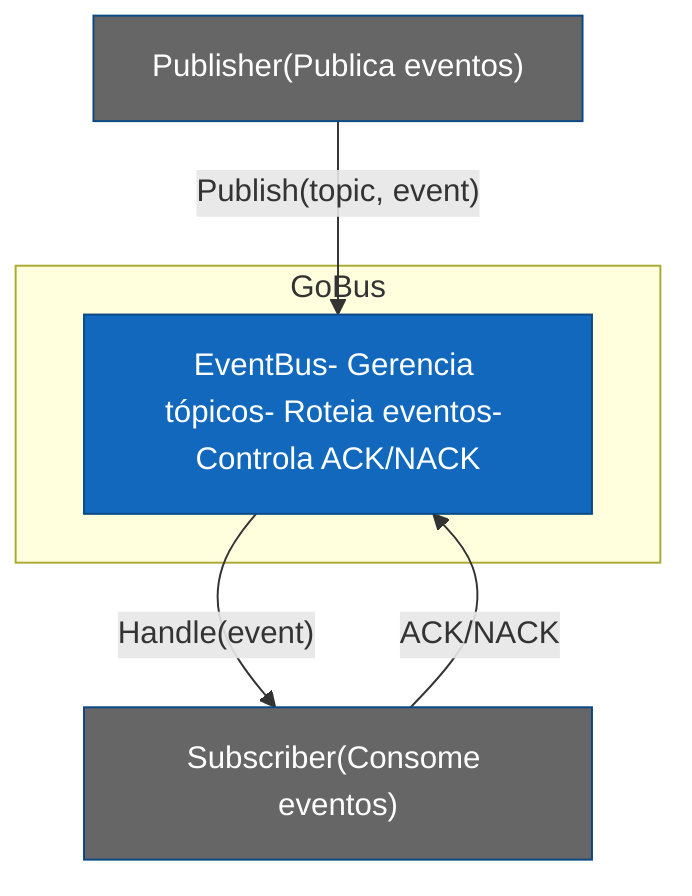

```mermaid
graph TB
    Publisher["Publisher(Publica eventos)"]
    Subscriber["Subscriber(Consome eventos)"]
    
    subgraph GoBus[GoBus]
        Bus["EventBus- Gerencia tópicos- Roteia eventos- Controla ACK/NACK"]
    end
    
    Publisher -->|"Publish(topic, event)"| Bus
    Bus -->|"Handle(event)"| Subscriber
    Subscriber -->|"ACK/NACK"| Bus

    classDef core fill:#1168bd,stroke:#0b4884,color:#ffffff
    classDef external fill:#666666,stroke:#0b4884,color:#ffffff
    
    class Bus core
    class Publisher,Subscriber external
```