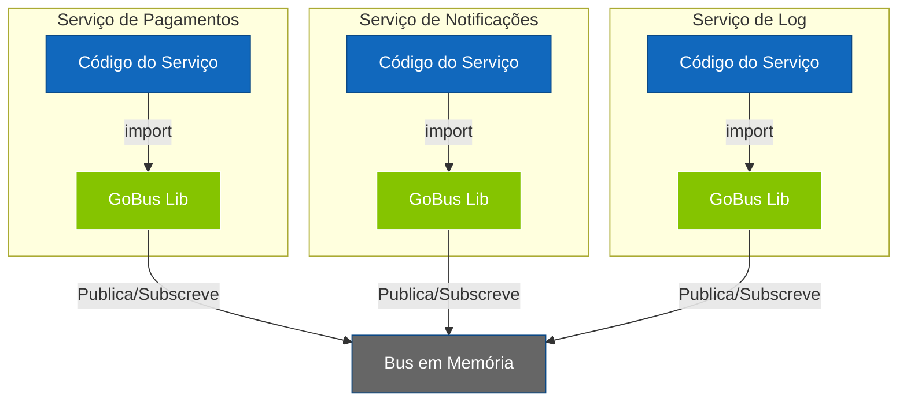

```mermaid
graph TB
    subgraph Service1[Serviço de Pagamentos]
        S1[Código do Serviço] -->|import| GB1[GoBus Lib]
    end
    
    subgraph Service2[Serviço de Notificações]
        S2[Código do Serviço] -->|import| GB2[GoBus Lib]
    end
    
    subgraph Service3[Serviço de Log]
        S3[Código do Serviço] -->|import| GB3[GoBus Lib]
    end
    
    GB1 -->|Publica/Subscreve| Bus[Bus em Memória]
    GB2 -->|Publica/Subscreve| Bus
    GB3 -->|Publica/Subscreve| Bus

    classDef service fill:#1168bd,stroke:#0b4884,color:#ffffff
    classDef lib fill:#85c400,stroke:#fff,color:#fff
    classDef core fill:#666666,stroke:#0b4884,color:#ffffff
    
    class S1,S2,S3 service
    class GB1,GB2,GB3 lib
    class Bus core
```